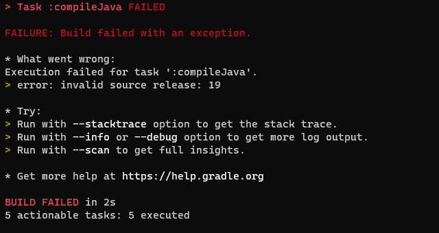
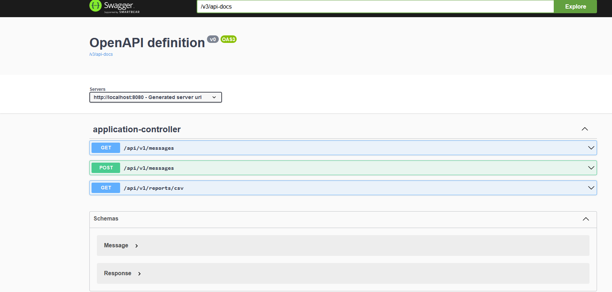

# Besedo technical test

This project is an answer to the test described in [PD-Javatechnicaltest-140323-1000.pdf](Documentation/PD-Javatechnicaltest-140323-1000.pdf).
The goal is be able to inject kind of "Message" , to search them and to generate a csv report.

## Summary

- [Prerequisites](#prerequisites)
- [Build](#build)
- [Run](#run)
- [Friendly UI](#friendly-ui)
- [Use personal application.properties](#use-personal-applicationproperties)
- [Additional configuration](#additional-configuration)
  - [Change report headers](#change-report-headers)
  - [Load database during start](#load-database-during-start)
- [Author](#author)

## Prerequisites

Java 19 is needed to compile the project.
Please go to https://www.oracle.com/java/technologies/javase/jdk19-archive-downloads.html (url should still be correct, otherwise google it !)

## Build

You can use the dos command line or the unix command line

```
gradlew clean build
```

If you work with several java versions you have to specify the java version and avoid the error below:


```
gradlew -Dorg.gradle.java.home=PATH_TO_YOUR_JDK19 clean build 
```

## Run

We use directly the gradle command as we decided in this case not to bother creating a bash/dos script.

```
gradlew bootrun
```
or
```
gradlew -Dorg.gradle.java.home=PATH_TO_YOUR_JDK19 bootrun 
```

## Friendly UI
Swagger is installed in this project, go to http://localhost:8080/swagger-ui/index.html.



If you don't want to use Swagger, you can use Postman, please find the query to add an object in [put object.postman_collection.json](Documentation/put object.postman_collection.json)

## Use personal application.properties
You provide your own application.properties, see example below, this is the way to configure it
```
gradlew -Dorg.gradle.java.home=PATH_TO_YOUR_JDK19  bootrun --args='--spring.config.location=c:/data/pro/besedo/technical_test/src/main/resources/application.properties'
```

## Additional configuration

### Change report headers
See example below
```
report.id=Idea
report.vowelsCount=Vowels detection
```

### Load database during start

You will have to provide you personal application.properties, please read [this chapter](#use-personal-applicationproperties).
Please activate this option
TODO (to implement with post action)

## Personal notes

- Is id from the object to ingest unique ?
- I tend to think that a MongoDB would suit well for this project. 

## Author

Quang-Minh TRAN